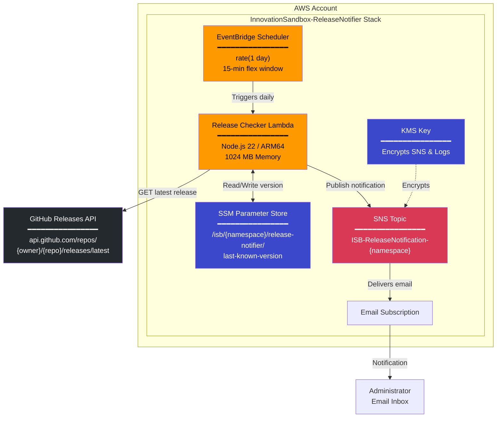
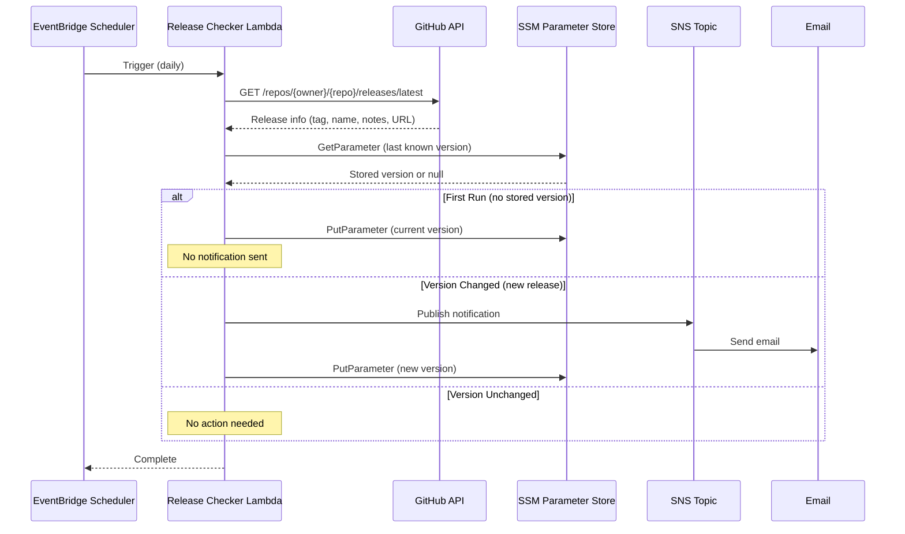

# GitHub Release Notifier Architecture

## Overview

The GitHub Release Notifier monitors a configurable GitHub repository for new releases and sends email notifications when detected. It runs as a serverless stack integrated with the Innovation Sandbox infrastructure.

## Architecture Diagram



## Data Flow



## Components

| Component | Resource | Purpose |
|-----------|----------|---------|
| Scheduler | EventBridge Scheduler | Triggers Lambda once per day |
| Lambda | ISB-ReleaseChecker-{namespace} | Checks GitHub, compares versions, sends notifications |
| SSM Parameter | /isb/{namespace}/release-notifier/last-known-version | Persists last known release version |
| SNS Topic | ISB-ReleaseNotification-{namespace} | Delivers email notifications |
| KMS Key | ISB KMS Key | Encrypts SNS messages and CloudWatch logs |

## Configuration

The stack accepts these CloudFormation parameters:

| Parameter | Description | Default |
|-----------|-------------|---------|
| Namespace | Solution namespace (shared with other ISB stacks) | myisb |
| GitHubOwner | GitHub repository owner | aws-solutions |
| GitHubRepo | GitHub repository name | innovation-sandbox-on-aws |
| NotificationEmail | Email address for notifications | (required) |


## Troubleshooting

### CloudWatch Logs Insights Queries

Use these queries against the log group `/aws/lambda/ISB-ReleaseChecker-{namespace}`:

**Recent executions summary:**
```
fields @timestamp, message, level
| filter @message like /Lambda invocation|New release|No new release|First run|No releases found/
| sort @timestamp desc
| limit 20
```

**Errors and warnings:**
```
fields @timestamp, level, message, errorType, errorMessage
| filter level in ["ERROR", "WARN", "CRITICAL"]
| sort @timestamp desc
| limit 50
```
